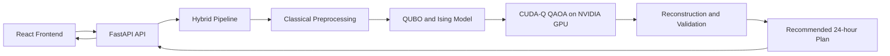
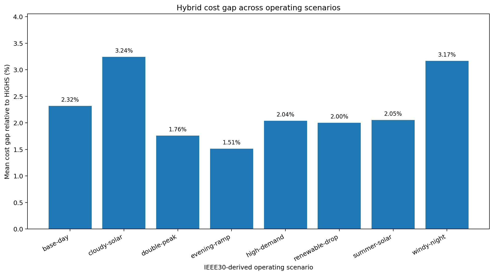
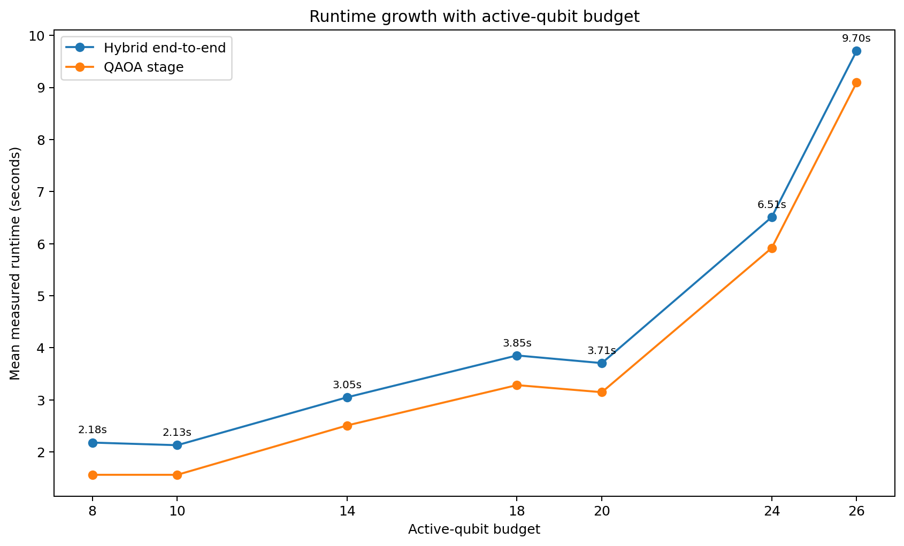
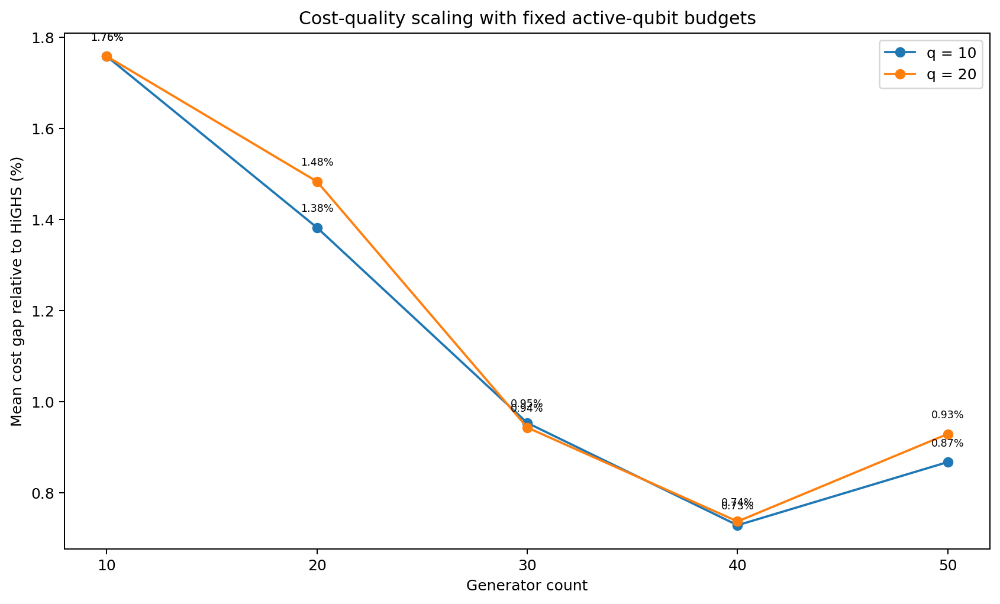

# Quantum-Assisted Unit Commitment ⚡

A full-stack student research prototype for **Hybrid quantum–classical Unit Commitment**, developed by **WATTS UP** for **the 2nd SEA Quantathon (QC4SG 2026)**.

<p align="center">
  <strong>24-hour scheduling · ADMM-guided active-block QAOA · CUDA-Q GPU execution · Classical validation</strong>
</p>

## Team Members

| Member |
|---|
| Lê Anh Dũng |
| Nguyễn Hồng Phúc |
| Nguyễn Ngọc Tin |
| Lê Thành Vinh |
| Jee Yanne Alecer |

**Team:** WATTS UP  
**Competition:** the 2nd SEA Quantathon / QC4SG 2026

## Overview

**Quantum-Assisted Unit Commitment** explores how a small quantum optimization subproblem can be integrated into a complete 24-hour power-system scheduling workflow.

The project does not encode the full Unit Commitment problem directly onto a quantum device. Instead, it:

1. builds an initial full commitment schedule using classical methods;
2. solves relaxed Economic Dispatch;
3. computes residual and dual-pressure signals;
4. selects a limited set of high-impact binary decisions;
5. formulates that active block as a QUBO;
6. maps the QUBO to an Ising Hamiltonian;
7. executes QAOA with CUDA-Q on an NVIDIA GPU;
8. reconstructs complete 24-hour schedules;
9. validates candidates using classical dispatch and feasibility checks.

The project is intended as a transparent student research and engineering prototype. It does **not** claim quantum advantage over mature classical solvers.

## Features

- ⚡ **24-hour Unit Commitment workflow** with demand, renewable generation and reserve requirements
- 🧠 **ADMM-guided active-block selection** to restrict the quantum search to high-impact commitment variables
- ⚛️ **QUBO-to-Ising-to-QAOA pipeline** using Qamomile and NVIDIA CUDA-Q
- 🎮 **NVIDIA GPU execution** through the CUDA-Q `nvidia` target
- ✅ **Classical schedule reconstruction and validation** before accepting a quantum candidate
- 📊 **React operational dashboard** for inputs, run progress and recommended schedules
- 🧪 **Three offline benchmark groups** with HiGHS as the classical reference
- 📈 **Generated JSON, CSV, PNG and HTML outputs**
- ☁️ **AWS EC2 GPU deployment configuration**
- 🧩 **Responsive interface** for mobile, tablet, laptop and desktop layouts

## Technology Stack

| Layer | Technologies |
|---|---|
| Frontend | React, Vite, JavaScript, CSS |
| Backend API | FastAPI, Pydantic, Uvicorn |
| Classical optimization | HiGHS, LP relaxation, Economic Dispatch |
| Hybrid optimization | ADMM-guided active-block selection, QUBO, Ising mapping, QAOA |
| Quantum software | Qamomile, NVIDIA CUDA-Q, CUDA-Q Solvers |
| GPU execution | NVIDIA CUDA target |
| Benchmarking | Python, pandas, NumPy, Matplotlib, JSON, CSV, HTML |
| Testing | pytest, FastAPI TestClient |
| Cloud deployment | AWS EC2 GPU, Docker, Docker Compose |
| Research data | MATPOWER case30-derived copper-plate Unit Commitment adaptation |

## Architecture



### Core Components

1. **Frontend**
   - Collects operating inputs
   - Displays scenario checks and execution progress
   - Presents the final Hybrid schedule and cost analysis
   - Exports result data

2. **Backend**
   - Validates API requests
   - Builds the initial commitment schedule
   - Runs relaxed Economic Dispatch
   - Selects the active quantum block
   - Executes QAOA
   - Reconstructs and validates full schedules

3. **Benchmark Suite**
   - Compares Hybrid cost and runtime against HiGHS
   - Studies active-qubit scaling
   - Studies generator scaling
   - Produces reproducible result bundles and an HTML report

## Hybrid Workflow

```text
24-hour operating inputs
        ↓
LP relaxation and heuristic commitment
        ↓
Relaxed Economic Dispatch
        ↓
Residual and dual-signal calculation
        ↓
ADMM-guided active-block selection
        ↓
Dynamic QUBO construction
        ↓
QUBO-to-Ising conversion
        ↓
QAOA with CUDA-Q on NVIDIA GPU
        ↓
Top-K measured bitstrings
        ↓
Full schedule reconstruction
        ↓
Exact Economic Dispatch and feasibility validation
        ↓
Best validated operating plan
```

## Experimental Evidence

The included benchmark report contains:

| Metric | Reported value |
|---|---:|
| Measured Hybrid runs | 75 |
| Discarded first runs | 25 |
| Aggregate Hybrid feasibility rate | 52.0% |
| Aggregate mean cost gap | 1.714% |
| Validated active-qubit range | 8–26 |
| Generator scaling range | 10–50 |

### Benchmark 1 — IEEE30 Scenario Comparison

Eight 24-hour scenarios reuse the same ten-generator case30-derived fleet.



### Benchmark 2 — Active-Qubit Scaling

The fixed ten-generator `double-peak` case is evaluated at:

```text
q = 8, 10, 14, 18, 20, 24, 26
```



### Benchmark 3 — Generator Scaling

The fleet is scaled to:

```text
10, 20, 30, 40 and 50 generators
```

at fixed active budgets `q=10` and `q=20`.



> The results show that the Hybrid pipeline can generate candidates with low single-digit cost gaps in the tested configurations. Strict feasibility is not consistent across every experiment and remains the main limitation of the current prototype.

Detailed results are available in:

- [`benchmark/README.md`](benchmark/README.md)
- [`benchmark/report/benchmark_report.html`](benchmark/report/benchmark_report.html)

## Prerequisites

### Local frontend development

- Node.js 20 or newer
- npm

### Backend tests and classical components

- Python 3.12
- pip
- HiGHS Python dependencies from the provided requirements files

### Real Hybrid GPU execution

- Linux x86_64
- NVIDIA GPU
- NVIDIA driver and CUDA-compatible runtime
- CUDA-Q target `nvidia`
- Qamomile and CUDA-Q Solvers

### AWS deployment

- AWS account
- EC2 GPU quota
- `g4dn.xlarge` or another supported NVIDIA GPU instance
- Docker Engine
- NVIDIA Container Toolkit

## Quick Start

### 1. Clone the Repository

```bash
git clone <repository-url>
cd Quantum-Assisted-Unit-Commitment
```

### 2. Run the Frontend

```bash
cd frontend
npm ci
npm run dev
```

Open:

```text
http://localhost:5173
```

### 3. Run the GPU Backend

```bash
cd ..
python -m pip install -r backend/requirements-quantum-colab.txt

CUDAQ_TARGET=nvidia \
REQUIRE_CUDAQ=1 \
PYTHONPATH=backend \
python -m uvicorn app.main:app --host 0.0.0.0 --port 8000
```

API endpoints:

```text
http://localhost:8000/api/health
http://localhost:8000/api/docs
```

### 4. Run Tests

```bash
python -m pip install \
  -r backend/requirements.txt \
  -r benchmark/requirements-benchmark.txt

PYTHONPATH=backend:. \
python -m pytest -q backend/tests benchmark/tests
```

Expected result for the current test suite:

```text
15 passed
```

## AWS GPU Deployment

The repository contains a complete single-instance AWS deployment:

```text
deploy/aws-ec2/
├── Dockerfile
├── compose.yaml
├── .env.example
├── README.md
└── scripts/
```

Deployment model:

```text
Browser
   ↓ HTTP
AWS EC2 GPU
   ↓
Docker container
   ├── React frontend
   ├── FastAPI backend
   └── CUDA-Q NVIDIA execution
```

See:

- [`AWS-DEPLOY.md`](AWS-DEPLOY.md)
- [`deploy/aws-ec2/README.md`](deploy/aws-ec2/README.md)

## Project Structure

```text
Quantum-Assisted-Unit-Commitment/
├── frontend/
│   ├── src/
│   ├── README.md
│   └── package.json
├── backend/
│   ├── app/
│   ├── tests/
│   ├── README.md
│   └── requirements-quantum-colab.txt
├── benchmark/
│   ├── data/
│   ├── experiments/
│   ├── report/
│   ├── results/
│   └── README.md
├── deploy/
│   └── aws-ec2/
├── docs/
│   ├── assets/
│   └── project-notes/
├── PiL-HQUC_Colab_GPU_Demo_API.ipynb
├── PiL-HQUC_Colab_GPU_Backend_Tests_and_3_Benchmarks.ipynb
├── AWS-DEPLOY.md
└── README.md
```

## Usage

### Interactive Demo

1. Select an operating scenario.
2. Review demand, renewable generation, grid and storage inputs.
3. Start the Hybrid optimization run.
4. Follow the execution log.
5. Inspect the final 24-hour schedule.
6. Review cost, dispatch and operating metrics.

### Offline Benchmarking

```bash
CUDAQ_TARGET=nvidia \
REQUIRE_CUDAQ=1 \
PYTHONPATH=backend:. \
python benchmark/run_all.py --experiments all
```

### Colab Workflows

- `PiL-HQUC_Colab_GPU_Demo_API.ipynb` starts the GPU backend for the interactive demo.
- `PiL-HQUC_Colab_GPU_Backend_Tests_and_3_Benchmarks.ipynb` runs tests and all benchmark groups.

## Testing

The test suite covers:

- API contract and health responses
- Active-block selection
- QUBO and Ising consistency
- Candidate reconstruction
- ADMM updates
- Classical HiGHS reference solving
- Benchmark configuration and output protocol

Run all tests:

```bash
PYTHONPATH=backend:. \
python -m pytest -q backend/tests benchmark/tests
```

## Configuration

The fixed quantum demo profile uses:

| Parameter | Value |
|---|---:|
| QAOA depth | 1 |
| Final shots | 256 |
| Optimizer fallback shots | 64 |
| COBYLA evaluations | 6 |
| Maximum ADMM-guided rounds | 2 |
| CUDA-Q target | `nvidia` |
| CPU fallback | Disabled in GPU deployment |

## Troubleshooting

### Frontend cannot reach the API

Confirm that:

```text
http://localhost:8000/api/health
```

is available and that `VITE_API_BASE_URL` is configured correctly when frontend and backend use different domains.

### CUDA-Q reports CPU or unavailable

Check:

```bash
nvidia-smi
echo "$CUDAQ_TARGET"
```

The production GPU configuration should use:

```bash
export CUDAQ_TARGET=nvidia
export REQUIRE_CUDAQ=1
```

### AWS instance cannot launch

Request an increase for:

```text
Running On-Demand G and VT instances
```

in the same AWS Region.

### Docker cannot access the GPU

Verify:

```bash
sudo docker run --rm --gpus all \
  nvcr.io/nvidia/cuda:12.4.1-base-ubuntu22.04 \
  nvidia-smi
```

## Current Limitations

- The current model is a **copper-plate Unit Commitment adaptation**, not network-constrained UC.
- CUDA-Q uses an NVIDIA GPU simulator rather than physical quantum hardware.
- The prototype does not demonstrate quantum advantage.
- Strict Hybrid feasibility is not achieved in every benchmark configuration.
- The frontend is a decision-support demonstration, not a certified grid-control system.
- AWS GPU deployment incurs compute and storage costs.


## License

This project is **proprietary research software** and is **not open source**.

The repository is published only for review, academic evaluation and
competition judging. Any use, execution, copying, modification,
redistribution, deployment, incorporation into another project or
commercial exploitation requires prior written authorization.

**No individual team member may grant permission independently. An
authorization is valid only after written approval from at least 3 of the
5 named copyright holders. Approval from one or two members is
insufficient.**

See [`LICENSE`](LICENSE) for the complete terms.

## Responsible Research Claim

This project demonstrates the engineering integration of active-set selection, QUBO construction, GPU QAOA, full schedule reconstruction and classical feasibility validation.

Its contribution is the complete and measurable Hybrid workflow—not a claim that present-day quantum optimization outperforms HiGHS.
