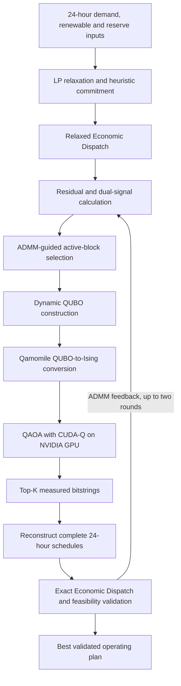
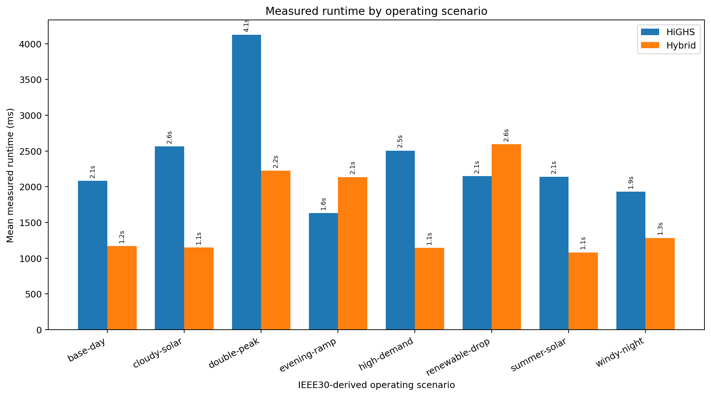

# Quantum-Assisted Unit Commitment

<p align="center">
  <strong>WATTS UP</strong><br>
  Student research project developed for <strong>the 2nd SEA Quantathon (QC4SG 2026)</strong>
</p>

<p align="center">
  <code>Unit Commitment</code> · <code>Hybrid Quantum–Classical Optimization</code> ·
  <code>QAOA</code> · <code>CUDA-Q</code> · <code>FastAPI</code> · <code>React</code>
</p>

## Overview

**Quantum-Assisted Unit Commitment** is a full-stack student research prototype that explores how a small quantum optimization subproblem can be integrated into a complete 24-hour power-system scheduling workflow.

The project does **not** send the full Unit Commitment problem to a quantum solver. Instead, the classical pipeline builds an initial schedule, identifies a limited set of high-impact commitment variables, and sends only that active block to QAOA. The resulting quantum candidates are reconstructed into complete schedules and checked using classical Economic Dispatch and feasibility validation.

The goal is to investigate a practical hybrid architecture under limited qubit budgets—not to claim quantum advantage over modern classical solvers.

## Project Highlights

| Area | Current implementation |
|---|---|
| Operational problem | 24-hour Unit Commitment and Economic Dispatch |
| Quantum role | Optimize a selected active block of binary commitment variables |
| Classical reference | Full UC solved with HiGHS |
| Quantum stack | Qamomile → CUDA-Q → NVIDIA GPU |
| Active-qubit range tested | 8–26 qubits |
| Generator scaling tested | 10–50 generators |
| Benchmark data family | MATPOWER case30-derived copper-plate UC adaptation |
| Measured Hybrid runs | 75 |
| Discarded initialization runs | 25 |
| Reported aggregate mean cost gap | 1.714% |
| Reported aggregate Hybrid feasibility rate | 52.0% |

> **Research interpretation:** The experiments show that a small active-block QAOA stage can be connected to a full scheduling and validation pipeline. They do not demonstrate quantum advantage, and strict feasibility remains the primary limitation of the current prototype.

## Hybrid Workflow



The quantum computer is therefore used as a **candidate generator for a carefully selected subproblem**, while classical optimization remains responsible for the complete system model, dispatch reconstruction and operational validation.

## Repository Structure

```text
.
├── frontend/      React/Vite interactive operational demo
├── backend/       FastAPI API and Hybrid optimization pipeline
├── benchmark/     IEEE30-derived experiments, results and report
├── PiL-HQUC_Colab_GPU_Demo_API.ipynb
├── PiL-HQUC_Colab_GPU_Backend_Tests_and_3_Benchmarks.ipynb
└── README.md
```

Detailed documentation:

- [Frontend documentation](frontend/README.md)
- [Backend documentation](backend/README.md)
- [Benchmark documentation](benchmark/README.md)
- [Generated benchmark report](benchmark/report/benchmark_report.html)

## Interactive Demo

The frontend presents the pipeline as an operational decision-support interface:

1. Select or adjust a 24-hour operating scenario.
2. Review demand, renewable and system inputs.
3. Run the Hybrid scheduling pipeline.
4. Inspect the recommended generator commitment and power-supply schedule.
5. Review operating cost, feasibility, renewable use and the execution log.

The operational application displays the **Hybrid method only**. Classical HiGHS results are kept in the offline benchmark suite so that the live demo remains focused on the recommended schedule rather than a model-comparison dashboard.

## Experimental Protocol

All reported experiments use the fixed GPU quantum protocol below:

| Parameter | Setting |
|---|---|
| CUDA-Q target | `nvidia` |
| QAOA depth | `1` |
| Final shots | `256` |
| Optimizer fallback shots | `64` |
| COBYLA objective evaluations | `6` |
| Maximum ADMM-guided rounds | `2` |
| HiGHS relative MIP-gap target | `0.5%` |
| HiGHS time limit | `60 seconds` per dataset |
| Timing protocol | First complete run of every unique quantum configuration is discarded |
| Measured timing | Second and later runs only |

The discarded run initializes CUDA, CUDA-Q/Qamomile and circuit-size-specific resources. Optimizer evaluations, sampling, reconstruction and candidate validation remain inside every measured Hybrid runtime.

## Benchmark Results

### 1. IEEE30-derived scenario comparison

Eight 24-hour demand and renewable profiles reuse the same ten-generator case30-derived fleet. HiGHS and Hybrid solve the same operating case.




| Scenario | HiGHS cost | Hybrid mean cost | Mean gap | HiGHS runtime | Hybrid runtime | Strictly feasible |
|---|---:|---:|---:|---:|---:|:---:|
| `base-day` | 15,451.45 | 15,809.93 | 2.32% | 2.08 s | 1.17 s | Yes |
| `cloudy-solar` | 16,894.80 | 17,442.32 | 3.24% | 2.56 s | 1.15 s | Yes |
| `double-peak` | 15,923.96 | 16,204.01 | 1.76% | 4.12 s | 2.22 s | No |
| `evening-ramp` | 16,079.65 | 16,322.50 | 1.51% | 1.63 s | 2.14 s | No |
| `high-demand` | 20,484.82 | 20,902.71 | 2.04% | 2.50 s | 1.14 s | Yes |
| `renewable-drop` | 16,174.95 | 16,498.34 | 2.00% | 2.15 s | 2.59 s | No |
| `summer-solar` | 15,129.46 | 15,440.26 | 2.05% | 2.14 s | 1.08 s | Yes |
| `windy-night` | 14,121.88 | 14,568.85 | 3.17% | 1.93 s | 1.28 s | Yes |

Across the eight scenarios, the reported mean cost gap ranges from **1.51% to 3.24%**. Five scenarios passed strict Hybrid feasibility validation in the reported runs, while `double-peak`, `evening-ramp` and `renewable-drop` did not.

Runtime should be interpreted carefully: the measured Hybrid pipeline was faster than the HiGHS reference on several cases, but the methods do not provide equivalent guarantees, and some faster Hybrid cases were not strictly feasible.

### 2. Active-qubit budget scaling

The fixed ten-generator `double-peak` instance was evaluated at:

```text
q = 8, 10, 14, 18, 20, 24, 26
```

Top-K remained fixed at 10, making the active-qubit budget the controlled variable.


| Active qubits | Mean cost gap | Hybrid runtime | QAOA runtime |
|---:|---:|---:|---:|
| 8 | 1.76% | 2.18 s | 1.56 s |
| 10 | 1.76% | 2.13 s | 1.56 s |
| 14 | 1.76% | 3.05 s | 2.51 s |
| 18 | 1.76% | 3.85 s | 3.28 s |
| 20 | 2.65% | 3.71 s | 3.15 s |
| 24 | 1.76% | 6.51 s | 5.92 s |
| 26 | 1.76% | 9.70 s | 9.09 s |

The cost result remained near **1.76%** for most qubit budgets, while measured Hybrid runtime increased from approximately **2.18 seconds at q=8** to **9.70 seconds at q=26**. This supports the project's motivation for limiting the quantum search to a selected active block.

However, strict feasibility was not achieved for the reported qubit-scaling runs. These values should therefore be read as evidence about candidate cost and runtime behavior, not as deployable operating schedules.

### 3. Generator scaling

The base fleet was replicated to:

```text
10, 20, 30, 40 and 50 generators
```

Hybrid was evaluated at two fixed active budgets, `q=10` and `q=20`. Top-K increased with the generator count.


| Generators | Mean gap at q=10 | Mean gap at q=20 | Feasible q=10 / q=20 |
|---:|---:|---:|:---:|
| 10 | 1.76% | 1.76% | No / No |
| 20 | 1.38% | 1.48% | Yes / Yes |
| 30 | 0.95% | 0.94% | Yes / Yes |
| 40 | 0.73% | 0.74% | Yes / Yes |
| 50 | 0.87% | 0.93% | Yes / Yes |

For fleets from 20 to 50 generators, both tested active-qubit budgets passed the report's strict feasibility indicator. The reported cost gaps remained below **1.5%** for those fleet sizes, showing how the full classical problem can grow while the quantum subproblem remains limited to 10 or 20 variables.

This is a controlled copper-plate scaling experiment, not a claim that the project solves a network-constrained 50-generator transmission UC model.

## What the Results Support

The current evidence supports four conclusions:

1. **End-to-end integration is possible.** QAOA-generated bitstrings can be reconstructed and evaluated inside a complete UC/ED workflow.
2. **A small active block can represent a larger scheduling problem.** Generator scaling does not require assigning a qubit to every commitment variable.
3. **Cost quality can remain close to a strong classical reference.** Reported mean gaps are generally in the low single-digit percentage range.
4. **Feasibility is not yet consistent.** The aggregate Hybrid feasibility rate is 52%, and this remains the main area for improvement.

## Current Limitations

- The experiments use a **MATPOWER case30-derived copper-plate adaptation**. They do not model transmission lines, voltage constraints or network congestion.
- CUDA-Q runs on an NVIDIA GPU simulator rather than physical quantum hardware.
- QAOA depth and optimizer evaluations are deliberately small for a practical student demonstration.
- A low operating-cost candidate is not sufficient unless it also passes strict reconstruction and feasibility checks.
- The results do not establish quantum speedup or quantum advantage over HiGHS.
- Benchmark conclusions are limited to the supplied scenarios, configurations and timing protocol.

## Run the Project

### Frontend

```bash
cd frontend
npm ci
npm run dev
```

The development server is available at `http://localhost:5173`.

### GPU Backend

Install the CUDA-Q environment and backend dependencies, then run:

```bash
python -m pip install -r backend/requirements-quantum-colab.txt

CUDAQ_TARGET=nvidia REQUIRE_CUDAQ=1 \
PYTHONPATH=backend \
python -m uvicorn app.main:app --host 0.0.0.0 --port 8000
```

### Tests

```bash
PYTHONPATH=backend:. pytest -q backend/tests benchmark/tests
```

### Offline Benchmarks

```bash
python -m pip install -r benchmark/requirements-benchmark.txt

CUDAQ_TARGET=nvidia REQUIRE_CUDAQ=1 \
PYTHONPATH=backend:. \
python benchmark/run_all.py --experiments all
```

The repository also includes two Colab notebooks:

- `PiL-HQUC_Colab_GPU_Demo_API.ipynb` — starts the GPU backend for the interactive frontend.
- `PiL-HQUC_Colab_GPU_Backend_Tests_and_3_Benchmarks.ipynb` — runs tests, executes all three benchmark groups and exports the result bundle.

## Technology Stack

| Layer | Technologies |
|---|---|
| Frontend | React, Vite, CSS |
| API | FastAPI, Pydantic, Uvicorn |
| Classical optimization | HiGHS, linear Economic Dispatch |
| Hybrid optimization | ADMM-guided active-block selection, QUBO, QAOA |
| Quantum software | Qamomile, NVIDIA CUDA-Q |
| Benchmarking | Python, pandas, Matplotlib, JSON/CSV/HTML reports |
| GPU environment | NVIDIA CUDA-capable runtime / Google Colab |

## Team

**WATTS UP**

| Team member |
|---|
| Lê Anh Dũng |
| Nguyễn Hồng Phúc |
| Nguyễn Ngọc Tin |
| Lê Thành Vinh |
| Jee Yanne Alecer |

Developed for **the 2nd SEA Quantathon (QC4SG 2026)**.

## Responsible Claim

This repository presents an educational and experimental Hybrid quantum–classical prototype. Its contribution is the design and implementation of a complete workflow—from operating inputs and active-set selection to GPU QAOA, schedule reconstruction, validation and reproducible benchmarking.

It should be evaluated as a student research and engineering project, not as evidence that current quantum optimization outperforms mature classical Unit Commitment solvers.
